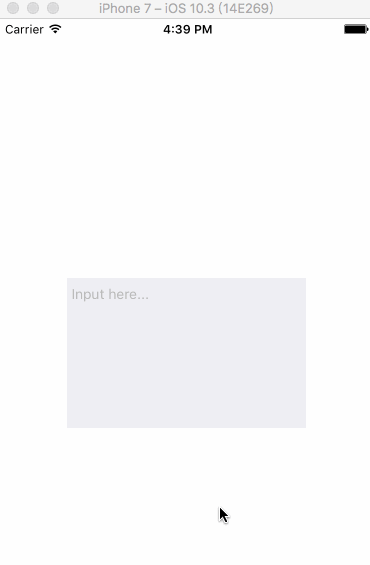

# XPTextView

[]()
[]()
[]()

给UITextView扩展placelder功能

# Feature

- 支持直接在Storyboard/xib中设置
- 支持Storyboard/xib实时预览
- 智能识别placeholder所处位置，避免占位文字紧贴父视图或与光标位置不一致的问题

## Requirements

- Xcode8.0+
- iOS8.0+

## Usage

1. 将XPTextView文件夹拖到项目中，并导入`#import "XPTextView.h"`

2. 直接给placeholder属性赋值即可

```ObjC
XPTextView *textView = [[XPTextView alloc] initWithFrame:CGRectMake(20.0, 20.0, 200.0, 100.0)];
textView.backgroundColor = [UIColor groupTableViewBackgroundColor];
textView.placeholder = @"Input here...";
textView.placeholderColor = [UIColor redColor];
[view addSubview:textView];
```

## Preview




## License

基于MIT License进行开源，详细内容请参阅`LICENSE`文件。
